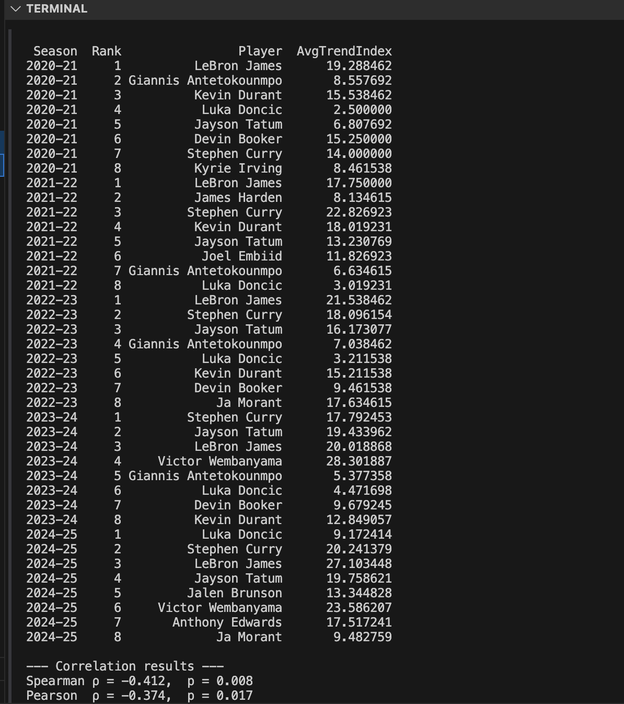

# NBA Jersey Sales Analysis and Its Relationship with Player Performance and Popularity

## Project Proposal

This project will examine what influences NBA players' jersey sales. The goal is to understand how factors like **player performance and team achievements** contribute to jersey popularity.  
By analyzing these elements, I hope to figure out **which aspects most strongly relate to jersey sales and public interest** in NBA players.

### Research Questions:
- How does a player's **on-court performance** (points per game, games played, minutes played) affect jersey sales?
- Is there a relationship between **team success (e.g., championship, playoffs)** and jersey sales?
- Can **Google search trends** explain spikes in jersey sales?

---

## Data to be Used

The analysis is built on **multiple data sources**, focusing on **the top NBA jersey sales rankings** and enriched with player-specific variables.

| Data Source                                      | Data Collected                                      | Purpose                                         |
|--------------------------------------------------|-----------------------------------------------------|------------------------------------------------|
| **Hoopshype (Top Jersey Sales)**                 | Jersey sales rankings for each NBA season          | Main target variable (ranking of sales)       |
| **Basketball-Reference**                         | Points per Game (PTS), Games Played (GP), Total Minutes Played (MIN), Awards won (MVP, All-Star, etc.) | Player performance metrics                    |
| **Google Trends (via pytrends API)**             | Search trend index for player names               | Player public popularity/interest metric     |
| **NBA.com / Basketball-Reference (Teams)**      | Team success: Champion status (0/1), Playoff status (0/1) | To analyze team effect on jersey sales       |

---

## Data Collection Plan

The data was collected and **merged from multiple sources**:

### Step 1: **Primary Dataset (Jersey Sales)**
- Top-8 NBA jersey sales per season from Hoopshype.

### Step 2: **Performance & Popularity Metrics**
- Stats (PTS/Game, Games Played, Minutes Played, Award Count) from Basketball-Reference.
- Google Trends index collected via pytrends.

---

## Final Dataset Sample Structure:

| Player          | Season   | Jersey Rank | PTS/Game | Games Played | Minutes/Game | Award Count | Avg Google Trends |
|-----------------|----------|-------------|----------|----------------|----------------|---------------|--------------------|
| LeBron James    | 2022-23  | 1           | 25.7     | 71             | 35.3           | 3             | 21.5               |
| Stephen Curry   | 2024-25  | 2           | 26.1     | 73             | 34.9           | 0             | 20.2               |

---

## Project GitHub
View the full codebase and data at: [yigitnarci/dsa210-project-yigit.narci](https://github.com/yigitnarci/dsa210-project-yigit.narci)

---

# NBA Jersey Sales Analysis

## Project Overview
This project investigates the drivers of NBA jersey sales over five seasons by combining sales rankings with player performance metrics, awards data, and Google search trends to uncover factors influencing popularity.

## Data Sources
- **Jersey Sales** (`jersey_ranks.csv`): Top-8 jersey sales rank per season (1 = highest seller).
- **Performance & Awards** (`nba_top8_last5_cleaned_with_awards.csv`): Points per game (PTS/Game), games played (GP), minutes per game (MIN/Game), and award counts.
- **Google Trends** (`combined_google_trends.csv`): Average weekly Trends index per player per season.

Seasons and player names are formatted consistently and merged on **Season** & **Player**, resulting in 35 complete records.

## Hypotheses
1. **Performance & Awards vs. Jersey Sales**
   - **H₀**: No correlation between on‐court metrics (PTS/Game, GP, MIN/Game) & award count and jersey rank.
   - **H₁**: A significant correlation exists.
2. **Google Trends vs. Jersey Sales**
   - **H₀**: No correlation between players’ average Google Trends index and jersey rank.
   - **H₁**: A significant correlation exists.

## Analytical Methods
1. **Data Preparation**: Clean and merge CSVs, ensure consistent season notation.
2. **Correlation Analysis**:
   - **Statistical Metrics**: Spearman & Pearson correlations for PTS/Game, GP, MIN/Game, and Award Count using `stat_correlation.py`.
   - **Google Trends**: Spearman & Pearson correlations using `google_graph_correlation.py`.
3. **Visualization**: Faceted scatter plots and regression lines per variable and season.

## Results
- **Performance & Awards** (`stat_correlation.py`):
  - Spearman & Pearson p > 0.05 for all metrics ⇒ **no significant correlations** ⇒ **H₀ retained**.
- **Google Trends** (`google_graph_correlation.py`):  
  - Spearman ρ = –0.412 (p = 0.008) and Pearson r = –0.374 (p = 0.017) ⇒ **statistically significant** ⇒ **H₀ rejected, H₁ accepted**.  
  - This suggests that **higher Google search interest is associated with better jersey sales** (lower rank).

## Conclusion
- **Performance metrics and awards** do **not** significantly influence jersey sales rankings ⇒ **H₀ retained**.
- **Google search popularity** shows a **statistically significant inverse correlation** with jersey sales ⇒ **H₀ rejected, H₁ accepted**.

## Visualizations

Each visualization supports the respective hypothesis test, highlighting key trends across five seasons.

### 1. Stats-Based Hypothesis

  
  
  
  
  

### 2. Google Trends Hypothesis

  

Each visualization supports the respective hypothesis test, highlighting key trends across five seasons.

