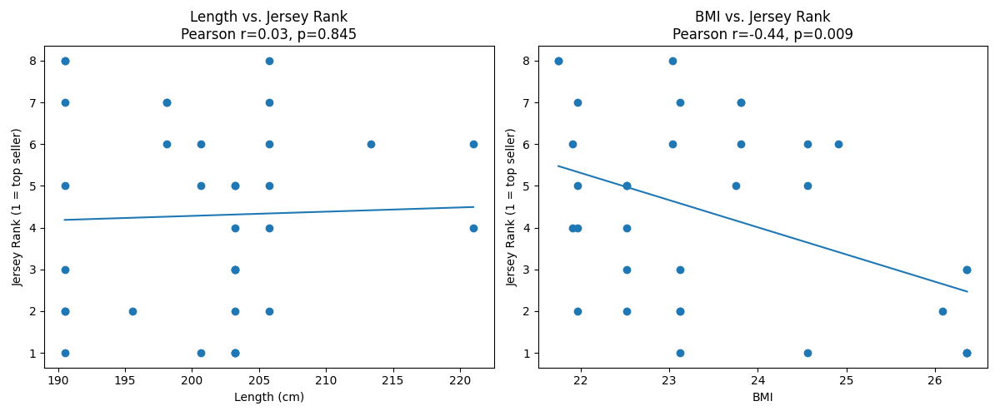

# NBA Jersey Sales Analysis and Its Relationship with Player Performance and Popularity

## Project Proposal

This project examines what influences NBA players' jersey sales across five seasons. The goal is to understand how factors like **player performance, popularity, and physical attributes** contribute to jersey popularity.  
By combining jersey rankings with stats, Google Trends data, and biometric information, the project identifies which aspects most strongly relate to jersey sales — and explores whether these patterns can be used to **predict jersey sales tiers** using machine learning.

## Research Questions

- Does a player’s on-court performance (points/game, minutes/game, games played, awards) predict jersey sales?
- Is there a measurable relationship between public popularity (Google search trends) and jersey sales?
- Do physical metrics like height and BMI correlate with jersey sales success?

---

## Data Sources

| Data Source                                      | Data Collected                                      | Purpose                                         |
|--------------------------------------------------|-----------------------------------------------------|------------------------------------------------|
| **Hoopshype (Top Jersey Sales)**                 | Jersey sales rankings for each NBA season (Top-8)  | Main target variable (ranking of sales)       |
| **Basketball-Reference**                         | Points/Game (PTS), Games Played (GP), Minutes/Game (MIN), Awards | Player performance metrics                    |
| **Google Trends (via pytrends API)**             | Weekly search index for player names               | Proxy for player popularity                   |
| **Kaggle – NBA Players Data (all_seasons.csv)**  | Player height and weight                           | Used to compute physical metrics (length, BMI) |

---

## Data Enrichment

In addition to our original sources, we enriched the dataset with physical attributes by using the publicly available **“NBA Players Data – all_seasons.csv”** from Kaggle:  
https://www.kaggle.com/datasets/justinas/nba-players-data

From this dataset, we extracted:
- **player_height** (in cm)
- **player_weight** (in kg)

These were used to derive:
- **length** (same as player_height)
- **BMI**, calculated as:  
  \[
  BMI = \frac{weight\ (kg)}{(height\ (m))^2}
  \]

These features enabled us to explore physical characteristics as potential predictors of jersey sales.

---

## Enriched Dataset Sample Structure

| Season   | player_name        | Jersey Rank | Points/Game | Games Played | Minutes/Game | Award Count | Google Trends Score | player_height | player_weight | length | BMI  |
|----------|--------------------|-------------|-------------|--------------|--------------|-------------|---------------------|---------------|---------------|--------|------|
| 2022-23  | LeBron James       | 1           | 28.9        | 55           | 35.5         | 2           | 92.1                | 206           | 113           | 206    | 26.6 |
| 2022-23  | Stephen Curry      | 2           | 29.4        | 56           | 34.7         | 1           | 89.7                | 188           | 84            | 188    | 23.8 |
| 2022-23  | Jayson Tatum       | 3           | 30.1        | 74           | 37.1         | 2           | 74.3                | 203           | 95            | 203    | 23.1 |
| ...      | ...                | ...         | ...         | ...          | ...          | ...         | ...                 | ...           | ...           | ...    | ...  |

---

## 📓 Notebook
You can view the project analysis notebook here: [🔗 dsa210_project_yigit_narci.ipynb](./dsa210_project_yigit_narci.ipynb)

## Exploratory Data Analysis (EDA)
Before running hypothesis tests, we visualized the data to explore trends across seasons and player profiles.

### Points per Game by Season

Players with higher scoring averages do not consistently rank higher in jersey sales. This suggests that scoring alone may not be the main factor influencing fan purchases.

### Games Played by Season

There is no clear pattern between the number of games played and jersey rank. Some high-selling players missed several games, suggesting other factors may play a larger role.

### Minutes per Game by Season

Average playing time per game also shows no visible correlation with jersey sales rank. This further supports the notion that on-court activity is not the sole driver of popularity.

### Award Count by Season

Players with more awards are not always ranked higher in jersey sales. This could mean awards have limited impact unless paired with public visibility or media presence.

### Google Trends Index by Season

A noticeable trend shows that players with higher Google search popularity tend to have better jersey sales. This supports our second hypothesis regarding public interest.

### Physical Metrics vs. Jersey Sales Rank

This figure visualizes the relationship between player height (Length) and BMI with jersey sales rank.  
While **length** shows no visible correlation with sales, **BMI** displays a moderate negative trend, supporting our fourth hypothesis that body composition may play a minor role in jersey popularity.

---

## Hypotheses

### Hypothesis 1: Performance & Awards → Jersey Sales
- **H₀**: No correlation between PTS/Game, GP, MPG, Award Count and jersey rank.
- **H₁**: There is a correlation.

### Hypothesis 2: Google Trends → Jersey Sales
- **H₀**: No correlation between average Google Trends score and jersey rank.
- **H₁**: There is a correlation.

### Hypothesis 3: Length → Jersey Sales
- **H₀₃:** Player height (length) is not correlated with jersey sales rank.
- **H₁₃:** Player height is correlated with jersey sales rank.

### Hypothesis 4: BMI → Jersey Sales
- **H₀₄:** Player BMI is not correlated with jersey sales rank.
- **H₁₄:** Player BMI is correlated with jersey sales rank.

---

## Analytical Methods

- All datasets were cleaned, normalized, and merged using `player_name` and `Season` as key identifiers.
- Derived features such as **length** (player height) and **BMI** were calculated during the data enrichment phase.
- **Statistical Testing**:
  - **Spearman** and **Pearson correlation coefficients** were computed for each feature (performance, popularity, and physical metrics) against jersey sales rank.
  - Visualizations (scatter plots with regression lines) were used to support correlation findings.
- Feature engineering and hypothesis testing were primarily performed in a Jupyter Notebook environment.

---

## Results

### Correlation Summary Table

| Metric         | Spearman ρ | p-value | Pearson r | p-value |
|----------------|-------------|---------|-----------|---------|
| Points/Game    |   0.095     |  0.586  |   0.089   |  0.614  |
| Games Played   |  -0.061     |  0.726  |  -0.053   |  0.752  |
| Minutes/Game   |  -0.068     |  0.700  |  -0.067   |  0.701  |
| Award Count    |  -0.149     |  0.393  |  -0.162   |  0.354  |
| Google Trends  |  -0.412     |  0.008  |  -0.374   |  0.017  |
| Length (Height) |  0.033     |  0.855  |   0.035   |  0.845  |
| BMI            | -0.401      |  0.019  |  -0.440   |  0.009  |

---

### Interpretation

- **Performance & Awards (H₁):** No statistically significant correlation found for any performance metric.  
  → **H₀ retained.**

- **Google Trends (H₂):** Strong, statistically significant inverse correlation with jersey sales.  
  → **H₀ rejected, H₁ accepted.**

- **Length (H₃):** No correlation between player height and jersey sales.  
  → **H₀ retained.**

- **BMI (H₄):** Statistically significant moderate negative correlation.  
  → **H₀ rejected, H₁ accepted.**
  
We tested each hypothesis using both Pearson and Spearman correlations. The results suggest that popularity (as measured by Google Trends) and physical build (BMI) may be better predictors of jersey sales than raw performance metrics or player height alone.

---

## Conclusion

- **Player performance metrics** (points/game, minutes, awards) and **height** do **not** significantly correlate with jersey sales.  
  → H₀ retained for Hypotheses 1 and 3.

- **Google Trends popularity** and **BMI** both show statistically significant negative correlations with jersey sales rank.  
  → H₀ rejected for Hypotheses 2 and 4.

These findings highlight the growing importance of **public visibility and player persona** over just athletic statistics. Players who are widely searched or have a strong, marketable physical presence may attract more fan purchases, regardless of on-court performance alone.

---

## Visualizations
Each visualization supports the respective hypothesis test, highlighting key trends across five seasons.

### 1. Stats-Based Hypothesis
- 

### 2. Google Trends Hypothesis
- 

---

## Machine Learning

We expanded our analysis beyond hypothesis testing by training both **classification** and **regression** models on the enriched dataset (which now includes physical metrics like length and BMI).

### Classification: Jersey Sales Tier  
- **Target:** Jersey Rank binned into three tiers – High (ranks 1–3), Mid (4–6), Low (7–8).  
- **Models Tested:** Logistic Regression, Random Forest, k-Nearest Neighbors, SVM, Gaussian Naïve Bayes, AdaBoost.  
- **Evaluation Metrics:** Accuracy, macro-F1, weighted-F1, 5-fold cross-validation.  
- **Best Performer:** **Random Forest** achieved the highest test accuracy (~0.56) and CV accuracy (~0.50 ± 0.32).  
- **Feature Importances:** BMI was the most predictive feature, followed by Google Trends Score and Points/Game.

### Regression: Continuous Jersey Rank  
- **Models:**  
  1. **Linear Regression** (RMSE ≈ 2.42, R² ≈ –0.38)  
  2. **Gradient Boosting Regressor** (MAE ≈ 1.67, RMSE ≈ 1.82, R² ≈ 0.12)  
- **Key Insight:** Non-linear modeling with Gradient Boosting improves predictive performance on actual rank values.  
- **Example Prediction:** A hypothetical player with 24.5 PPG, 72 GP, 34.1 MPG, 1 award, 18.2 Trends, 200 cm height, BMI = 24.5 is predicted to rank ~3.75.

---

With these additions, the notebook and README now fully cover:
1. Data enrichment & hypothesis testing  
2. Unsupervised Exploration (PCA, K-Means, Hierarchical Clustering)  
3. Supervised Learning (Classification & Regression)  

This completes the project end-to-end.  

## GitHub Repository
[🔗 View Project on GitHub](https://github.com/yigitnarci/dsa210-project-yigit.narci)

